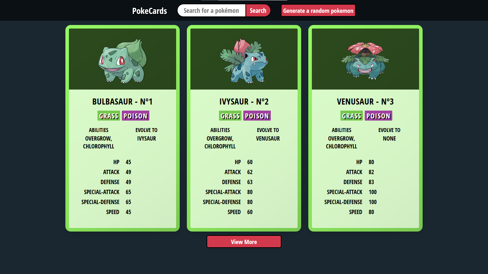
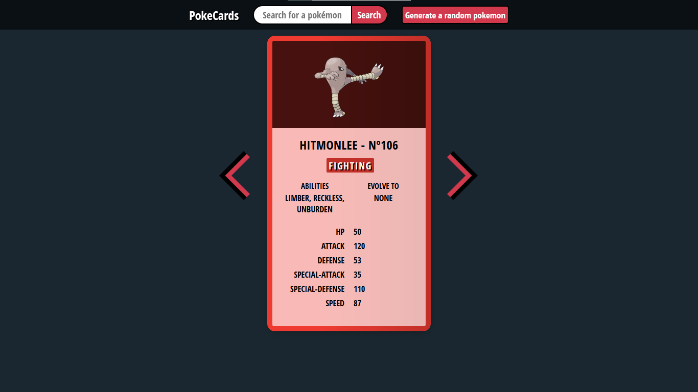

# PokeCards
-----------------------

Este projeto consiste no desenvolvimento de uma aplicação responsiva que gera cards de pokémons através do consumo da API [PokeApi](https://github.com/PokeAPI/pokeapi).

### Github Pages
[Link do projeto](https://douglasbomfim.github.io/PokeCards/)

### Tecnologias
- Javascript
- HTML5
- CSS

### Telas

> Tela Inicial.

> Navegação.